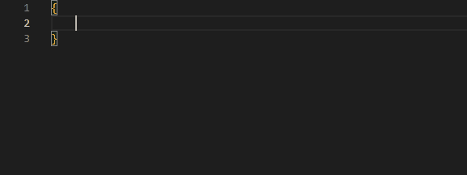

# VS Code Origins Snippets

    
      
    

 

### **Latest release: 1.0.6**
This extension for Visual Studio Code adds snippets from the Minecraft Origins mod. Check out the [Origins wiki](https://origins.readthedocs.io/en/latest) for more information. You can obtain the extension by clicking [here](https://marketplace.visualstudio.com/items?itemName=UnderGame.vscode-origins-snippets) or searching it up in VS Code.

## Usage
Type part of a snippet, press enter, and the snippet gets sent. You can also press `Ctrl`+`Space` to activate snippets.

> Right now this extension is only covering the latest version of the Origins wiki (1.8.1). Some snippets might be different depending on the version you are coding your origin for, so backwards compatibility isn't guaranteed.

>If you'd like to port this to another version, you can use 'generator.py' and manually edit the files.

## Origins Snippets
| Snippet          | Purpose                                               |
| ---------------- | ----------------------------------------------------- |
| `*` (data)       | Inserts a data snippet.                               |
| `*` (powers)     | Inserts a power snippet.                              |
| `bientity:*`     | Inserts a bientity **action**/**condition** snippet.  |
| `entity:*`       | Inserts an entity **action**/**condition** snippet.   |
| `block:*`        | Inserts a block **action**/**condition** snippet.     |
| `item:*`         | Inserts an item **action**/**condition** snippet.     |
| `meta:*`         | Inserts a meta **action**/**condition** snippet.      |
| `biome:*`        | Inserts a biome **condition** snippet.                |
| `damage:*`       | Inserts a damage **condition** snippet.               |
| `fluid:*`        | Inserts a fluid **condition** snippet.                |
#### * (anything valid from the wiki)

## Release Notes
See the [changelog](CHANGELOG.md) for the latest changes!
